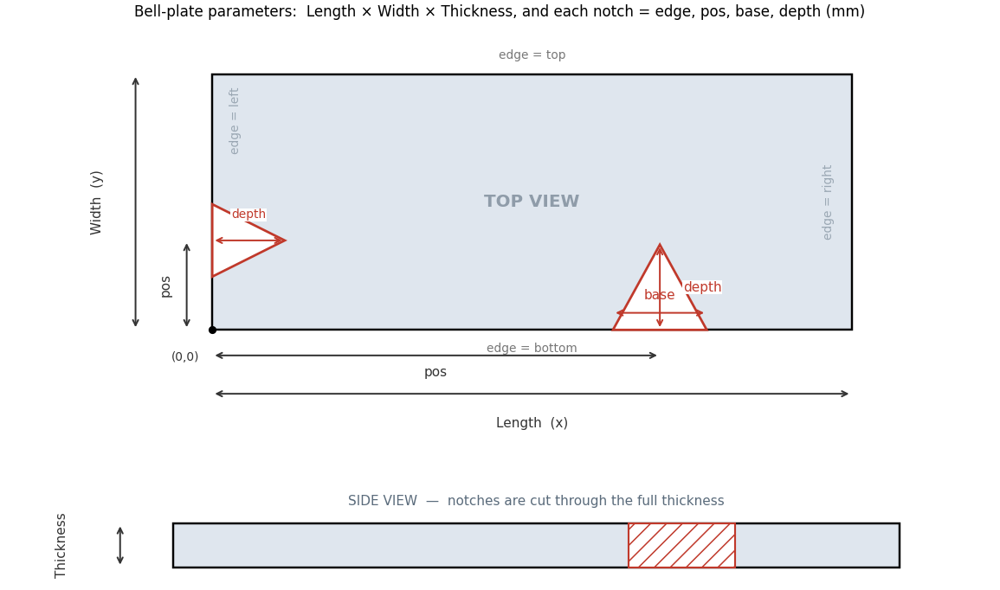

# Bell-plate modal analysis

Interactive FEM tool for the natural frequencies and mode shapes of rectangular **bell
plates** (struck metal idiophones) with triangular edge incuts. 3D-solid free–free modal
analysis: gmsh mesh → scikit-fem P2 tetrahedra → eigenvalue solve → matplotlib mode shapes,
driven from a small in-notebook control panel.

## What the inputs mean



Plate **Length × Width × Thickness**; each incut is `edge, pos, base, depth` (mm) — `pos` is
measured from the lower-left corner along the chosen edge, `depth` points into the plate, and
notches are cut through the full thickness. (This diagram also appears inside the notebook,
above the control panel.)

## Run it in your browser (no install)

**App view** (just the control panel + results, no code — best for sharing):

https://mybinder.org/v2/gh/BasSpijkerman/bell-plate-tuning/HEAD?urlpath=voila%2Frender%2Fbell_plate_fem.ipynb

**Full notebook view** (code visible, editable):

[](https://mybinder.org/v2/gh/BasSpijkerman/bell-plate-tuning/HEAD?labpath=bell_plate_fem.ipynb)

> The first launch builds the environment and can take a few minutes; later launches are
> faster. Sessions are temporary (no saving) and have limited memory, so keep `f_max`, the
> number of modes, and the mesh density modest.

## Run it locally

```
pip install -r requirements.txt
jupyter lab bell_plate_fem.ipynb   # then Run All, and use the control panel
```

## Files
- `bell_plate_fem.ipynb` — the notebook (analysis + control panel).
- `requirements.txt` — Python dependencies (used by Binder and local installs).
- `apt.txt` — system libraries gmsh needs on the Binder (Ubuntu) image.
- `param_diagram.png` — labelled diagram of the input parameters.
